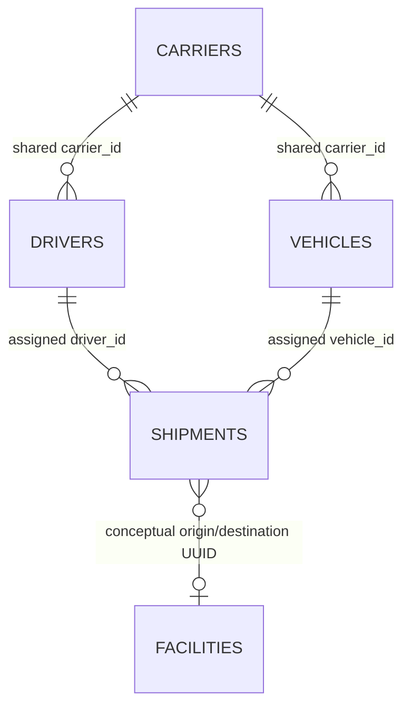

# Transport Management System

The TMS is SetuHaul's source for driver and vehicle assignment, the original
shipment plan, and high-level shipment lifecycle. It is a FastAPI component
backed by Supabase PostgreSQL and protected by caller JWTs plus Row Level
Security (RLS).

## Ownership

TMS owns `drivers`, `vehicles`, and `shipments`. `carriers` is shared reference
master data: TMS stores and compares `carrier_id`, but does not expose carrier
CRUD or own carrier lifecycle. Facilities are external even though shipment
origin and destination values are facility UUIDs.

TMS does **not** own ETA updates, exceptions, conversations, facilities, docks,
slots, appointments, check-ins, queues, allocations, or messages. Context
responses intentionally exclude all of those fields.



The local reconstruction does not add facility foreign keys because the exact
hosted DDL is unavailable.

## Schema provenance and migrations

`supabase/migrations/*_local_development_reconstruction.sql` is clearly marked
as a **local development reconstruction**, not a production snapshot. The
provided inventory omitted complete nullability, defaults, foreign keys,
actions, indexes, triggers, grants, policies, and migration history. Do not
push that reconstruction over the hosted database.

The following migrations are separate and additive:

- `*_tms_constraints_and_indexes.sql`: reviewed TMS checks, core assignment
  foreign keys, and query indexes.
- `*_tms_authorization.sql`: grants and RLS only for drivers, vehicles, and
  shipments.

For a hosted deployment, first reconcile migration history and apply only the
reviewed additive changes against an exact schema snapshot.

## Configuration

Copy `.env.example` to an ignored `.env` and set:

```dotenv
SUPABASE_URL=https://your-project.supabase.co
SUPABASE_PUBLISHABLE_KEY=your-publishable-key
ENVIRONMENT=development
LOG_LEVEL=INFO
```

Normal requests never use a service-role key. Each bearer token is verified by
Supabase Auth and forwarded to the Data API so RLS evaluates the caller.
Authorization uses `app_metadata.tms_role`, never user-editable metadata.

Roles:

- `ADMIN_1`: read, insert, and update TMS tables.
- `AGENT_READER`: read-only TMS access.
- Anonymous users and DELETE operations are denied.

After changing a user's app metadata, refresh their token before testing
because existing JWT claims remain stale until refresh.

## Local development

Requirements: Python 3.11+, `uv`, Docker, and the Supabase CLI.

```bash
uv sync --extra dev
npx supabase start
npx supabase db reset
npx supabase test db
uv run uvicorn setuhaul.main:app --reload
```

The small deterministic fixtures are loaded from `supabase/seed.sql`. Generate
a larger seven-day TMS-only dataset with:

```bash
uv run python scripts/generate_tms_dataset.py --output /tmp/tms_dataset.sql
```

Defaults are 100 drivers, 120 vehicles, 800 shipments, and seed `20260808`.
Generated rows reuse configured carrier/facility UUIDs and contain no WMS,
ETA, Check-In, chat, exception, messaging, or allocation data.

## Data contracts and business rules

- All primary/path IDs are UUIDs; drivers also expose `driver_code`, and
  vehicles expose `vehicle_number`.
- `priority` remains an integer. This implementation assumes it is positive
  and that larger values mean greater urgency; that meaning was not supplied
  as an authoritative database fact.
- `planned_eta` is the original nullable plan and must include a timezone when
  present. Driver-declared ETA belongs to Driver Chat/ETA and never overwrites
  this field.
- Active context statuses are explicitly: `planned`, `in_transit`, `arrived`,
  `waiting`, `unloading`, and `exception`. `completed` and `cancelled` are not
  active. Compatibility states do not move their subordinate workflows into
  TMS.
- An active assignment requires an active driver, active vehicle, and matching
  carrier IDs.
- No hard-delete API is exposed.

## HTTP API

All routes except `/health` require `Authorization: Bearer <access-token>`.

| Method | Path | Role |
|---|---|---|
| GET | `/health` | Public |
| GET | `/api/v1/tms/drivers?phone=...` | Reader/Admin |
| GET | `/api/v1/tms/drivers/{driver_id}` | Reader/Admin |
| GET | `/api/v1/tms/drivers/{driver_id}/shipments` | Reader/Admin |
| GET | `/api/v1/tms/drivers/{driver_id}/active-shipments` | Reader/Admin |
| POST/PATCH | `/api/v1/tms/drivers[/{driver_id}]` | Admin |
| GET | `/api/v1/tms/vehicles/{vehicle_id}` | Reader/Admin |
| POST/PATCH | `/api/v1/tms/vehicles[/{vehicle_id}]` | Admin |
| GET | `/api/v1/tms/shipments` | Reader/Admin |
| GET | `/api/v1/tms/shipments/{shipment_id}` | Reader/Admin |
| POST/PATCH | `/api/v1/tms/shipments[/{shipment_id}]` | Admin |
| GET | `/api/v1/tms/context/drivers/{driver_id}` | Reader/Admin |
| GET | `/api/v1/tms/context/shipments/{shipment_id}` | Reader/Admin |

Shipment lists accept `driver_id`, `destination_id`, `status`, `limit`, and
`offset`. The default limit is 100 and maximum is 500.

```bash
curl -H "Authorization: Bearer $ACCESS_TOKEN" \
  http://127.0.0.1:8000/api/v1/tms/context/drivers/30000000-0000-0000-0000-000000000027
```

Single candidate response:

```json
{
  "resolution": "resolved",
  "requires_disambiguation": false,
  "driver": {
    "driver_id": "30000000-0000-0000-0000-000000000027",
    "driver_code": "DRV-027",
    "name": "Ravi Kumar",
    "carrier_id": "10000000-0000-0000-0000-000000000001",
    "status": "active",
    "active_flag": true
  },
  "active_shipments": [
    {
      "shipment_id": "50000000-0000-0000-0000-000000001042",
      "vehicle": {
        "vehicle_id": "40000000-0000-0000-0000-000000000031",
        "vehicle_number": "VEH-031",
        "vehicle_type": "dry_van",
        "length_ft": 32,
        "refrigeration_required": false,
        "status": "active"
      },
      "origin_id": "20000000-0000-0000-0000-000000000002",
      "destination_id": "20000000-0000-0000-0000-000000000001",
      "product_class": "dry_freight",
      "priority": 2,
      "planned_eta": "2026-08-08T11:50:00Z",
      "expected_unload_minutes": 40,
      "status": "in_transit"
    }
  ]
}
```

Two or more candidates return `resolution: "ambiguous"`, set
`requires_disambiguation` to true, and return every candidate without guessing.
A known inactive/no-assignment driver returns `not_found` with an empty list;
an unknown driver returns a structured 404.

## Verification

```bash
uv run pytest -q
uv run python -m compileall src scripts
```

Database verification additionally requires the local Supabase stack and runs
the RLS, grants, constraints, indexes, and non-TMS authorization-boundary tests
in `supabase/tests/tms_rls.sql`.
