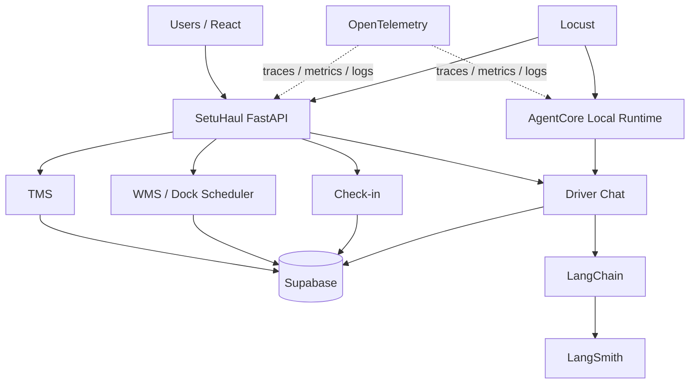

# SetuHaul Local Harness and Observability Guide

This is the authoritative guide for SetuHaul's local load-testing, telemetry,
AI tracing, and AgentCore runtime harness. It documents only verified local
capabilities. AWS deployment and CloudWatch configuration are not included.

## 1. What the harness is

| Component | Purpose |
| --- | --- |
| Locust | Tests how SetuHaul APIs and the local AgentCore runtime behave under concurrent load. |
| OpenTelemetry | Shows where backend time is spent through traces, metrics, and structured logs. |
| LangSmith | Shows what happened inside Driver Chat, including LangChain, LLM, and tool runs. |
| AgentCore | Provides a local runtime wrapper around the existing SetuHaul Driver Chat path. |

AgentCore does **not** own deterministic scheduling. It hosts the conversational
path; existing FastAPI services, scheduler rules, repositories, and Supabase
remain authoritative.

## 2. Architecture



- FastAPI authenticates requests and exposes the four service APIs.
- TMS owns shipment planning and assignment operations.
- WMS/Dock Scheduler owns deterministic slot feasibility and appointments.
- Check-in owns deterministic gate, queue, dock, and completion transitions.
- Driver Chat interprets conversation and calls existing service tools.
- Supabase is the operational system of record.
- Locust generates local traffic; it does not bypass API contracts.
- OpenTelemetry observes backend execution; LangSmith observes AI runs.

## 3. Deterministic design

- LangChain handles conversational understanding and tool orchestration.
- The LLM never chooses dock capacity or decides slot feasibility.
- The Dock Scheduler applies deterministic capacity and compatibility rules.
- Check-in state transitions remain deterministic and service-owned.
- Supabase remains the source of truth.
- AgentCore only hosts and wraps the existing conversational path.

## 4. Harness components

| Path | Responsibility |
| --- | --- |
| `load_tests/locustfile.py` | Exposes user classes and runs selected-class preflight. |
| `load_tests/auth.py` | Obtains, caches, and refreshes local Supabase test sessions. |
| `load_tests/preflight.py` | Validates only workloads selected in Locust. |
| `load_tests/scenarios/common.py` | Shared environment and LT-record safety helpers. |
| `load_tests/scenarios/read_only.py` | Public health and optional authenticated reads. |
| `load_tests/scenarios/driver.py` | Driver snapshot, profile, and slot-context chat reads. |
| `load_tests/scenarios/tms.py` | TMS reads and explicitly enabled LT-only mutations. |
| `load_tests/scenarios/wms.py` | Scheduler reads and explicitly enabled LT-only operations. |
| `load_tests/scenarios/checkin.py` | One deterministic lifecycle per prepared LT shipment. |
| `load_tests/scenarios/agentcore.py` | Read-only two-message AgentCore conversation. |
| `load_tests/seed_checkin.py` | API-based preparation of dedicated LT shipments. |
| `load_tests/results/` | Saved local Locust CSV and HTML reports. |
| `src/setuhaul/infrastructure/telemetry.py` | Existing OpenTelemetry and LangSmith integration. |
| `app/SetuHaulAgent/main.py` | Adapter from AgentCore to existing Driver Chat. |
| `agentcore/agentcore.json` | Local AgentCore project/runtime definition. |

## 5. Automatic load-test authentication

```text
Existing TEST_ACCESS_TOKEN?
        |
       yes ----> reuse it
        |
        no
        |
load-test email/password
        |
Supabase Auth password login
        |
fresh access + refresh session
        |
cache in memory per role
        |
refresh shortly before expiry
```

Place credentials only in the local, gitignored `.env` or shell environment:

```dotenv
SUPABASE_URL=https://your-project.supabase.co
SUPABASE_PUBLISHABLE_KEY=your-publishable-key
LOAD_TEST_EMAIL=test-user@example.com
LOAD_TEST_PASSWORD=replace-locally
```

`TEST_ACCESS_TOKEN` remains the highest-precedence manual fallback. Otherwise,
the harness logs in with test credentials, caches one session per role for the
Locust process, and refreshes it 90 seconds before expiration. One failed
refresh triggers one clean password login.

Optional role-specific pairs override the generic pair for their workload:

```dotenv
LOAD_TEST_DRIVER_EMAIL=driver-load-test@example.com
LOAD_TEST_DRIVER_PASSWORD=replace-locally
LOAD_TEST_TMS_EMAIL=tms-load-test@example.com
LOAD_TEST_TMS_PASSWORD=replace-locally
LOAD_TEST_WMS_EMAIL=wms-load-test@example.com
LOAD_TEST_WMS_PASSWORD=replace-locally
LOAD_TEST_CHECKIN_EMAIL=checkin-load-test@example.com
LOAD_TEST_CHECKIN_PASSWORD=replace-locally
```

Passwords, publishable keys, access tokens, and refresh tokens are never
printed. Refresh tokens are never written to disk.

## 6. Locust Web UI

Install dependencies and start FastAPI:

```sh
cd /path/to/setuhaul-logistics-ai
source .venv/bin/activate
pip install -e ".[dev]"
set -a
source .env
set +a
export OTEL_ENABLED=true
PYTHONPATH=src uvicorn setuhaul.main:app --host 127.0.0.1 --port 8000
```

In another terminal, start the class-picker UI:

```sh
cd /path/to/setuhaul-logistics-ai
source .venv/bin/activate
set -a
source .env
set +a
locust -f load_tests/locustfile.py --class-picker
```

Open `http://localhost:8089`, select **one** workload, choose users and spawn
rate, then start.

| Level | Users | Purpose |
| --- | ---: | --- |
| API sanity | 1 | Configuration and response check. |
| Small concurrency | 5 | Basic concurrent behavior. |
| Local baseline | 10 | Repeatable workstation baseline. |

Available classes are `ReadOnlyUser`, `DriverUser`, `TmsUser`, `WmsUser`,
`CheckinUser`, and `AgentCoreDriverUser`. Preflight validates only the selected
class. Missing configuration produces one readable error before user spawn.

### Local troubleshooting

- `Load-test preflight failed: ... authentication requires ...`: configure a
  current `TEST_ACCESS_TOKEN` or the Supabase URL, publishable key, and matching
  generic/role-specific load-test credentials.
- `CheckinUser: LOAD_TEST_ALLOW_MUTATIONS=true is required`: enable mutations
  only for a controlled run using prepared LT-only data.
- `CheckinUser ... dedicated shipments`: choose no more users than entries in
  the selected manifest, or prepare a new manifest through the API seeder.
- `AgentCoreDriverUser cannot reach ...`: start `agentcore dev --port 8090
  --logs`, then retry only that workload.
- If a CLI `--host` is supplied, it overrides every class host. Omit it in the
  class-picker UI so API users use port 8000 and AgentCore uses port 8090.

## 7. Previous API baseline results

| Metric | 10 users | 100 users |
| --- | ---: | ---: |
| Requests | 278 | 1,017 |
| Failures | 0 | 0 |
| RPS | 9.59 | 17.67 |
| p50 | 520 ms | 3,500 ms |
| p95 | 710 ms | 11,000 ms |
| p99 | 1,100 ms | 12,000 ms |
| Maximum | 1,131 ms | 12,313 ms |

The slowest 100-user endpoint was `tms.shipments.list`.

## 8. Driver Chat monitoring

LangSmith is verified with project `setuhaul` and root run name
`setuhaul.driver_chat`. Safe metadata includes `shipment_id`, `thread_id`,
`exception_id`, and `environment` where available. Runs expose LLM calls, tool
calls, errors, retries, latency, and provider token counts when supplied.

## 9. Driver Chat latency

| Segment | Time |
| --- | ---: |
| HTTP total | 10.846 s |
| Profile/auth | 589 ms |
| Shipment/context | 1.389 s |
| Snapshot | 4.963 s |
| Repository/Supabase-bound spans | 6.071 s |
| LangChain | 2.088 s |
| LLM | 2.078 s |
| Persistence/post-processing | 625 ms |
| Unattributed | 65 ms |

Nested and repository spans overlap and must not be summed naively. The main
bottleneck was snapshot/slot-scheduler context preparation; slot context alone
was approximately 3.171 seconds.

## 10. Check-in load testing

| Run | Result |
| --- | --- |
| Smoke | 1 shipment; 4/4 lifecycle operations successful. |
| Pilot | 10 shipments; 40/40 lifecycle operations successful. |
| Full | 100 attempted; 87 completed. |

The 100-shipment run measured:

- Lifecycle requests: 348
- Scheduler preparation failures: 13
- Lifecycle HTTP failures: 0
- RPS: 18.69
- p50: 3,000 ms
- p95: 4,300 ms
- p99: 4,600 ms
- Maximum: 4,676 ms
- Gate p95: 3,300 ms
- Queue p95: 3,300 ms
- Dock p95: 4,600 ms
- Complete p95: 3,700 ms
- Scheduler preparation `409` responses: 183
- Terminal scheduler conflicts: 13
- Invalid Check-in transitions: 0

All 87 scheduler-prepared shipments successfully completed Check-in. The 13
incomplete shipments were scheduler preparation conflicts, not lifecycle
failures. The harness does not weaken scheduler rules to force preparation.

## 11. OpenTelemetry under load

The final Check-in test emitted approximately 6,952 new spans. OpenTelemetry
traces, metrics, and structured logs remained active under load. Use
`OTEL_ENABLED=true` and the existing local OTLP endpoint configuration.

## 12. AgentCore local

Status: **LOCAL READY**.

```sh
set -a
source .env
set +a
export PYTHONPATH=src
agentcore dev --port 8090 --logs
```

The endpoint is `http://localhost:8090/invocations`. Conversation continuity
uses `X-Amzn-Bedrock-AgentCore-Runtime-Session-Id` with a unique placeholder
such as `setuhaul-local-<unique-id>`.

The verified first request returned the existing dock appointment. A follow-up
using the same AgentCore session preserved the same shipment, thread, and
shipment context. LangSmith and OpenTelemetry both worked. The local adapter
uses its configured driver token internally; Locust does not send a Supabase
bearer token to `/invocations`.

## 13. AgentCore Locust testing

Start AgentCore first, then start the class-picker and choose only
`AgentCoreDriverUser`. Its default host is `http://localhost:8090`.

Each virtual user creates one `setuhaul-locust-<uuid>` session and reuses it for:

1. `What is the status of my dock appointment?` as `agentcore.driver_chat.status`.
2. `And what should I do next?` as `agentcore.driver_chat.followup`.

The workload is read-only. Success requires HTTP 200, JSON, and a non-empty
`result`; `shipment_id` and `thread_id` are optional metadata. Recommended runs
are 1 user for sanity, 5 for small concurrency, and 10 for a local baseline.
Review requests, failures, RPS, p50, p95, p99, and maximum latency separately
for both stable metric names.

## 14. Known local warnings

`Attempting to instrument FastAPI app while already instrumented` is currently
non-blocking. Do not redesign telemetry only to remove it unless duplicate
spans are verified.

The local AgentCore OTLP metrics receiver previously returned HTTP 404 for
metric batches while traces and logs still worked. Application behavior stayed
functional. AWS and cloud behavior are out of scope for this guide version.

## 15. Safety

- Never commit `.env` or `.env.local`.
- Never commit access tokens or refresh tokens.
- Never print passwords, tokens, or Supabase keys.
- Mutation scenarios require `LOAD_TEST_ALLOW_MUTATIONS=true`.
- Mutation IDs require `LOAD_TEST_SHIPMENT_PREFIX`, default `LT-`.
- Check-in requires dedicated prepared LT shipment data.
- AgentCore load traffic is read-only.
- Supabase remains the source of truth.

## 16. Final local architecture status

| Component | Status |
| --- | --- |
| FastAPI harness | Ready |
| Locust API testing | Ready |
| Locust Check-in testing | Ready |
| Locust AgentCore testing | Ready |
| Automatic test authentication | Ready |
| OpenTelemetry traces | Ready |
| OpenTelemetry metrics | Ready locally with noted AgentCore receiver limitation |
| Structured logs | Ready |
| LangSmith | Ready |
| AgentCore local | Ready |
| AgentCore session continuity | Ready |
| AWS deployment | Not started |
